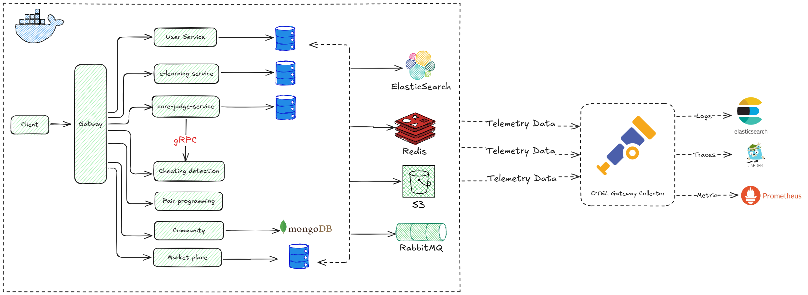
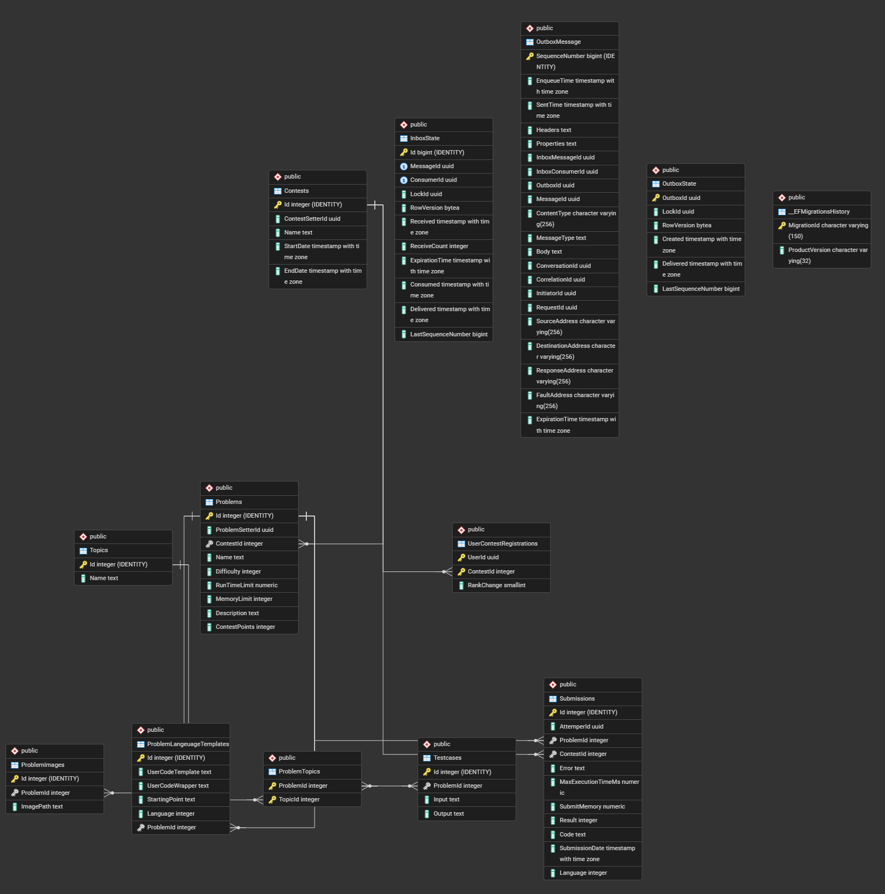
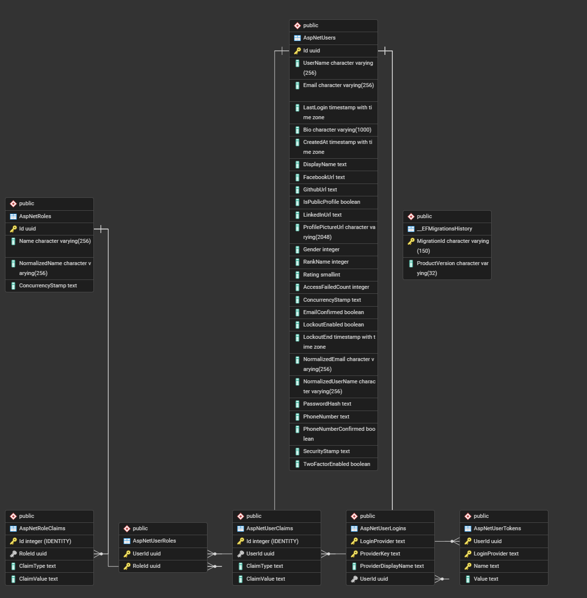

# 🚀 Microservices Online Judge System (JudgeSync)

<div align="center">
  
</div>

## 📖 Table of Contents

- [Overview](#-overview)
- [Main Features](#-main-features)
- [Project Highlights](#-project-highlights)
- [System Architecture](#-system-architecture)
  - [API Gateway](#1-api-gateway)
  - [CoreJudge Service](#2-corejudge-service)
  - [Users Service](#3-users-service)
  - [Community Service](#4-community-service)
  - [Collaboration Service](#5-collaboration-service)
  - [Frontend Web Client](#6-frontend-web-client)
- [Infrastructure & Distributed Systems](#-infrastructure--distributed-systems)
- [Tech Stack](#-tech-stack)
- [Getting Started](#-getting-started)
- [Governance & Constitution](#-governance--constitution)

---

## 🌟 Overview

**JudgeSync** is a cloud-native, highly scalable, **distributed system platform** for E-Learning, E-Commerce, Online Judge, Community, and User Management services. 

It is composed of several autonomous microservices that work together seamlessly:
- **API Gateway**: Routes traffic and abstracts internal services.
- **CoreJudge Service**: Manages code execution and problem solving.
- **Users Service**: Handles identity and access management.
- **Community Service**: Drives social interactions, articles, and file uploads.
- **Collaboration Service**: Enables real-time code editing.
- **Frontend Web Client**: Delivers a rich user interface.

---

## ✨ Main Features

- **Distributed Code Execution:** Secure, sandboxed code execution using isolated **Docker** containers.
- **Real-Time Collaborative Editing:** CRDT-based real-time document synchronization for paired programming and collaborative problem-solving.
- **Resilient Microservices Architecture:** Independent services utilizing varied architectural patterns (Clean Architecture, Vertical Slice) tailored to specific domain needs.
- **Event-Driven Communication:** Asynchronous messaging via **RabbitMQ** and MassTransit, ensuring eventual consistency and high availability.
- **Comprehensive Observability:** Distributed tracing with **OpenTelemetry** and **Jaeger**, coupled with centralized logging via Serilog and **Elasticsearch**.
- **Secure Identity & Access Management:** Robust JWT-based authentication and role-based access control (RBAC).

---

## 🏆 Project Highlights

- Built a distributed microservices platform for E-Learning, E-Commerce, Online Judge, Community, and User Management services.
- Developed services with ASP.NET Core using Clean Architecture, Vertical Slice, CQRS, and Mediator Pattern.
- Built a multi-language online judge with a secure **Docker**-based sandbox enforcing execution time and memory limits.
- Integrated **PostgreSQL**, **MongoDB**, **Redis**, and **RabbitMQ** for persistence, caching, and event-driven communication.
- Implemented file storage using **S3 Buckets** and **Pre-Signed URLs** for secure uploads and downloads.
- Integrated **Elasticsearch** for full-text search, log indexing, and leaderboard queries.
- Configured **YARP** as an API Gateway for routing, Jwt Auth and service abstraction.
- Implemented observability with **OpenTelemetry**, exporting logs to **Elasticsearch**, traces to **Jaeger**, and metrics to **Prometheus**.
- Improved reliability through rate limiting, monitoring, and Circuit Breakers.
- Containerized all services with **Docker** and **Docker Compose**.

---

## 🏛️ System Architecture

The platform comprises several autonomous services, communicating asynchronously and fronted by a robust API Gateway.

### 1. API Gateway (`api.gateway`)
- **Technology:** ASP.NET 8 + **YARP** (Yet Another Reverse Proxy)
- **Role:** Single entry point for all client traffic. It handles routing (`/users`, `/corejudge`, `/collaboration`, `/community`), terminating external connections and forwarding them securely to internal services.

### 2. CoreJudge Service (`corejudge.api`)
- **Architecture Pattern:** Strict Clean Architecture (4-layer separation: Domain, Application, Infrastructure, API).
- **Responsibility:** Manages problems, submissions, contests, and handles the orchestration of secure code execution.
- **Data Store:** **PostgreSQL** (Relational Data), **Redis** (Caching), **Elasticsearch** (Search).
- **Key Technical Points:**
  - Uses CQRS with MediatR for command/query separation.
  - Implements the **Transactional Outbox Pattern** (MassTransit + EF Core) to guarantee at-least-once delivery of domain events without distributed transactions.
  - User code is executed inside isolated **Docker** containers using `Docker.DotNet`.
  - **Database Design:**
    <br/>
    

### 3. Users Service (`users.api`)
- **Architecture Pattern:** Flat Carter Modules.
- **Responsibility:** Identity management, Authentication (JWT issuance/refresh), and Role-Based Access Control (RBAC).
- **Data Store:** **PostgreSQL** (`usersdb`).
- **Key Technical Points:**
  - Uses ASP.NET Core Identity.
  - Implements strict JWT validation (Issuer, Audience, Lifetime, Signature).
  - **Database Design:**
    <br/>
    

### 4. Community Service (`community.api`)
- **Architecture Pattern:** Vertical Slice Architecture.
- **Responsibility:** Manages articles, comments, votes, bookmarks, and user recommendations.
- **Data Store:** **MongoDB** (`CommunityDb`).
- **Key Technical Points:**
  - Code is organized by feature slice, ensuring high cohesion.
  - Utilizes NoSQL for flexible document storage and high read throughput for community feeds.
  - **File Uploads:** Uses **S3 Buckets** for efficient file storage and utilizes **Pre-Signed URLs** for secure, direct-to-cloud uploads and downloads.

### 5. Collaboration Service (`collaboration.api`)
- **Technology:** Node.js, Express, Socket.IO, Yjs.
- **Responsibility:** Real-time collaborative code editing.
- **Data Store:** LevelDB (ephemeral local file storage for Yjs documents).
- **Key Technical Points:**
  - Employs **CRDTs (Conflict-free Replicated Data Types)** via Yjs to resolve concurrent edit conflicts without central locking.
  - Low-latency WebSocket connections proxied through the API Gateway.

### 6. Frontend Web Client (`web`)
- **Technology:** React 19, Vite 8.
- **Responsibility:** Single Page Application (SPA) providing the user interface.
- **Key Technical Points:**
  - Uses Monaco Editor for a rich code editing experience.
  - Integrates `y-monaco` and `y-socket.io` for real-time multiplayer editing capabilities.
  - State management uses functional React hooks and custom `useApi` abstractions.

---

## 🛠️ Infrastructure & Distributed Systems

JudgeSync leverages cutting-edge infrastructure tools to maintain reliability, scalability, and observability:

- **Asynchronous Messaging (**RabbitMQ** & MassTransit):** 
  Services decouple operations by emitting domain events. MassTransit handles complexities like exponential backoff retries, Dead Letter Queues (DLQ), and inbox deduplication.
- **Data Persistence:** Polyglot persistence strategy with each service exclusively owning its data store (**PostgreSQL**, **MongoDB**, LevelDB, **S3 Buckets**). Cross-service data access is strictly forbidden.
- **Observability Stack:**
  - **OpenTelemetry** & **Jaeger**: 100% sampling distributed tracing across HTTP clients, gRPC, **PostgreSQL**, and **Redis**.
  - **Serilog & ELK Stack:** Context-enriched structured logging aggregated in **Elasticsearch** and visualized in Kibana. Metrics are also exported to **Prometheus**.
- **Containerization (**Docker Compose**):** Multi-stage Dockerfiles for optimized, trimmed `.NET` runtime images. Complete local development environment orchestrated via `compose.yaml` and `compose-override.yaml`.

---

## ⚙️ Tech Stack

### Backend
- **Frameworks:** ASP.NET Core 8, Node.js (Express)
- **Data:** Entity Framework Core 8, **MongoDB** Driver, StackExchange.**Redis**, Elastic.Clients.**Elasticsearch**, **S3 Buckets**
- **Messaging:** MassTransit 8.2, **RabbitMQ**
- **Patterns:** Clean Architecture, Vertical Slice, CQRS, Mediator, FluentValidation, AutoMapper, Carter
- **Auth:** ASP.NET Core Identity, JWT Bearer

### Infrastructure & Observability
- **Gateway:** **YARP**
- **Containerization:** **Docker**, **Docker Compose**
- **Observability:** **OpenTelemetry**, **Jaeger**, **Prometheus**, **Elasticsearch**, Kibana, Serilog

### Frontend
- **Framework:** React 19, Vite 8, React Router v7
- **UI:** Vanilla CSS, Lucide React
- **Editor:** `@monaco-editor/react`, Yjs (CRDT)

---

## 🚀 Getting Started

1. Clone the repository
2. Ensure **Docker** and **Docker Compose** are installed.
3. Run the complete microservices stack:
   ```bash
   docker compose up -d
   ```
4. Access the web interface at `http://localhost:5173`.

---

## 📜 Governance & Constitution

This repository adheres to strict architectural guidelines defined in the [Constitution](.specify/memory/constitution.md). All contributions must align with the specified bounded contexts, database ownership rules, and tech stack constraints.
